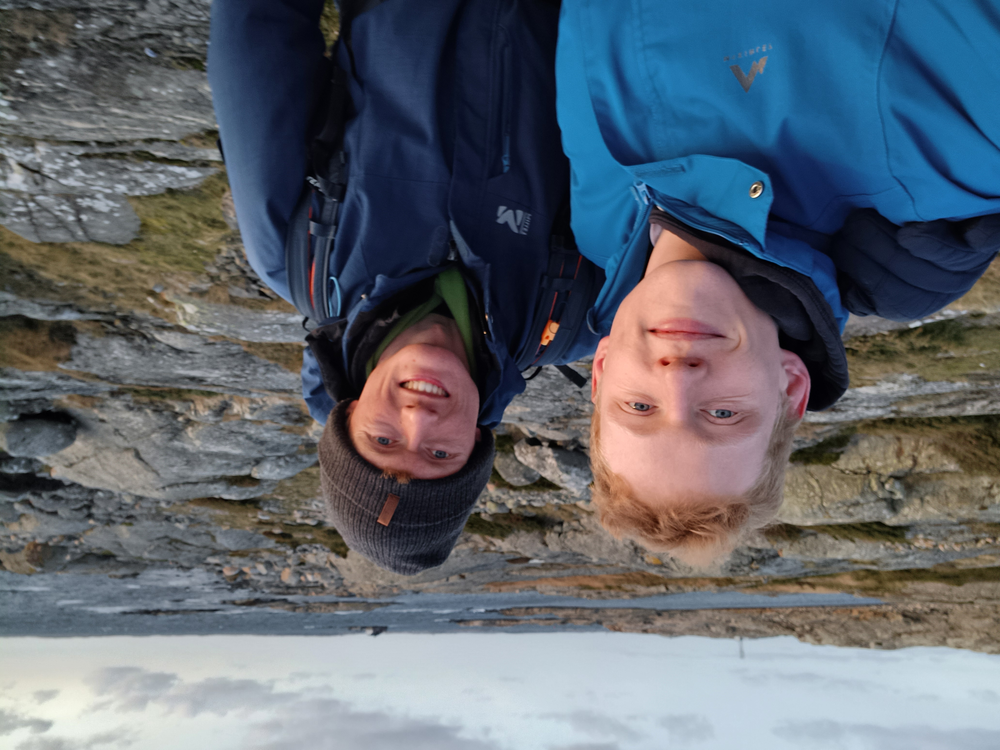

 
<i>Me (left) and my brother (right) in Göteborg, Sweden.</i>

## About me
Hi everyone, I am a physics master’s student at the University of Heidelberg! 

## Projects
- **Master’s thesis** (in progress): Working title: “Unveiling the Most Luminous Quasar Around Cosmic Noon and Be
yond,” conducted at the Max Planck Institute for Astronomy (MPIA) in Heidelberg under the supervision of Dr. Julien Wolf and Dr. Silvia Belladitta
- **Bachelor’s thesis**: “Passively Evolving Galaxies in the Vicinity of the Quasar APM 08279+5255 at 
Redshift z = 3.9” at the Landessternwarte Heidelberg, supervised by Prof. Dr. Jochen Heidt

## Research interests
My particular interest lies in investigating dynamic processes in active galactic nuclei and the formation 
and evolution of (super-) massive black holes, approached from both observational and theoretical perspectives. I am especially fascinated by the role of extreme objects, such as quasars, in cosmic structure 
formation and galaxy evolution.

## Skills 
- **Languages:** German (native), English (fluent, C1), French (intermediate, B1)
- **Programming skills:**  Python, C++, ADQL, TOPCAT, Source Extractor
- **Activities:**  Triathlon and bouldering; regular voluntary work as a lifeguard team leader and instructor at 
the Baltic Sea; swimming coach with DLRG Nottuln and DLRG Dossenheim for over 10 years

## Contact
- **E-mail:** sebastian.splitthoff@gmail.com

splitthoff.github.io
